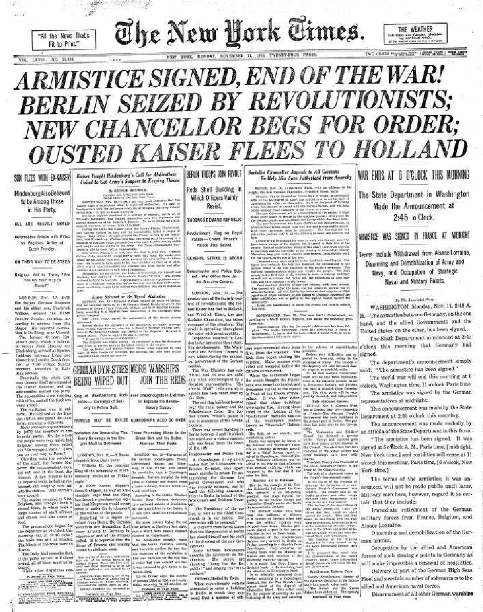

layout: true
  

  <table>
    <tr>
      <td style="text-align:right">Sächsische Landesbibliothek – Staats- und Universitätsbibliothek</td>
      <td>06.06.19</td>
      <td style="text-align:right"><a href="https://www.slub-dresden.de/">www.slub-dresden.de</a></td>
    </tr>
    <tr>
      <td style="text-align:right">Referat 2.5</td>
      <td />
    </tr>
  </table>

  <table>
    <tr>
      <td style="text-align:left"><b>Kay-Michael Würzner</b></td>
    </tr>
    <tr>
      <td style="text-align:left">Referat 2.5</td>
    </tr>
    <tr>
      <td style="font-size:8pt"><b>6. Juni 2019</b></td>
    </tr>
    <tr>
      <td style="font-size:8pt">IT-Kolloquium, SLUB Dresden</td>
    </tr>
  </table>

---

class: title-slide

# (Open-Source-)OCR-Workflows
## Eine Aufriss über Techniken und Werkzeuge zur automatischen Texterkennung

---

# Überblick

- Einleitung
  + Was ist OCR?
  + Wozu benutzt man OCR?
- Technische Aspekte
  + Komponenten eines einfachen OCR-Workflows
  + Modelltraining
  + Optimierungsoptionen
  + Komplexere OCR-Workflows
- Nichttechnische Aspekte
  + OCR-D
  + Open-Source, und dann?

---

class: part-slide

# Was ist OCR?

---

# Was ist OCR?

.cols[
.sixty[
- **O**ptical **C**haracter **R**ecognition: Automatische Erfassung von Text in Bildern
- ursprünglich begrenzt auf Zeichenerkennung
- heute häufig Synonym für den gesamten Texterfassungsprozess
  + Bildvorverarbeitung
  + Layoutanalyse (OLR)
  + Zeilenerkennung
  + ...
]
.fourty[

]
]

---

# Zeichenorientierte Ansätze

.cols[
.seventy[
- Erkennung erfolgt *glyphenweise*
  - **Mustervergleich**: Vergleich der Zeichenbilder zu in einem „Setzkasten“ gespeicherten Glyphen **Pixel für Pixel**
  - **Merkmalsvergleich**: Zerlegung der Glyphen in vordefinierte, bedeutungstragende **Eigenschaften** wie *Einfärbung*, *Kurven*, *Linien* etc. und Vergleich zu Referenzmaterialien
- Kombination beider Ansätze!
- Zerlegung der Seite in *Zeilen* und *Zeichen* notwendig
- Vorgehen in `ABBYY FineReader`
]
.fourty[

]
]

---

# Zeilenorientierte Ansätze

- Erkennung erfolgt *zeilenweise*
  1. **Skalierung:** einheitliche Höhe für alle Zeilen
  2. **Merkmalsextraktion**: Raster mit festgelegter Anzahl (horizontaler) Zeilen und variabler Anzahl (vertikaler) Spalten → Zeilen als Sequenzen binärwertiger Vektoren fixer Länge

- kontextsensitive Erkennung über *Übergangswahrscheinlichkeiten* der Vektoren
- Zerlegung der Seite in *Zeilen* notwendig
- Vorgehen *robuster* gegenüber Varianz durch Artefakte als zeichenorientierte Ansätze
- `Tesseract` (ab Version 4), `OCRopus`, `kraken`, `Calamari`
  + Einsatz *neuronaler Netze* für die Sequenzklassifikation

---

class: part-slide

# Wozu benutzt man OCR?
