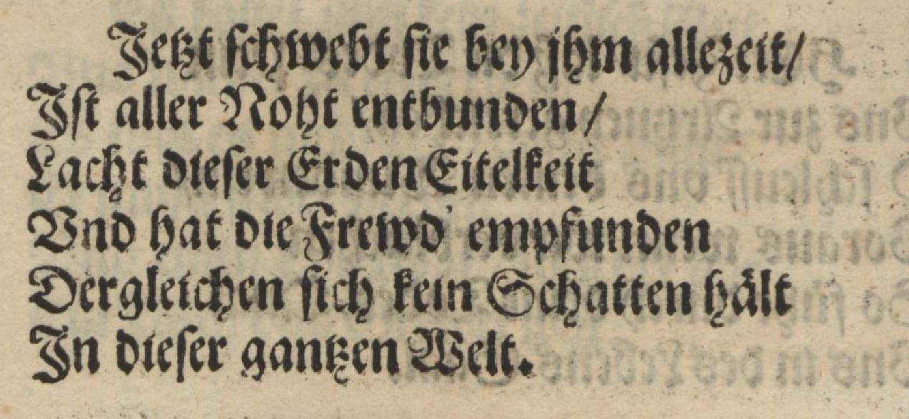
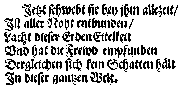
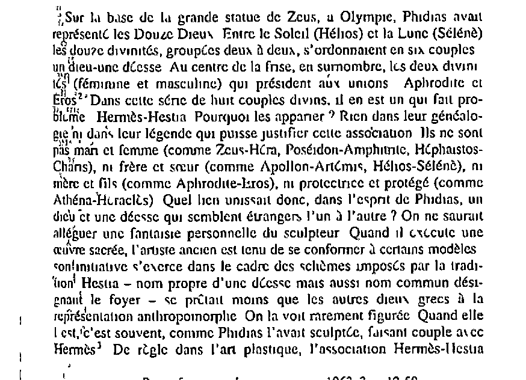
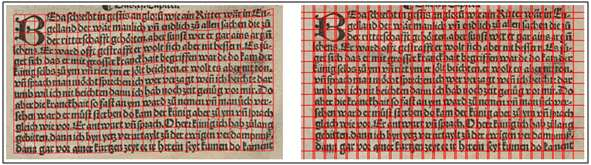
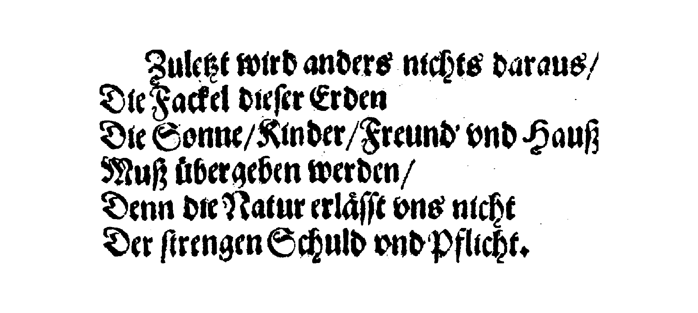
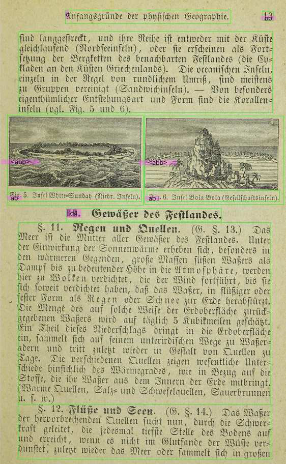
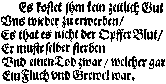

layout: true
  

  <table>
    <tr>
      <td style="text-align:right">Sächsische Landesbibliothek – Staats- und Universitätsbibliothek</td>
      <td>06.06.19</td>
      <td style="text-align:right"><a href="https://www.slub-dresden.de/">www.slub-dresden.de</a></td>
    </tr>
    <tr>
      <td style="text-align:right">Referat 2.5</td>
      <td />
    </tr>
  </table>

  <table>
    <tr>
      <td style="text-align:left"><b>Kay-Michael Würzner</b></td>
    </tr>
    <tr>
      <td style="text-align:left">Referat 2.5</td>
    </tr>
    <tr>
      <td style="font-size:8pt"><b>6. Juni 2019</b></td>
    </tr>
    <tr>
      <td style="font-size:8pt">IT-Kolloquium, SLUB Dresden</td>
    </tr>
  </table>

---

class: title-slide
count: false

# (Open-Source-)OCR-Workflows
## Eine Aufriss über Techniken und Werkzeuge zur automatischen Texterkennung

---

# Überblick

- Einleitung
  + Was ist OCR?
  + Wozu benutzt man OCR?
  + Warum überhaupt OCR?
- Technische Aspekte
  + Komponenten einfacher OCR-Workflows
  + Modelltraining
  + Optimierungsoptionen
  + Komplexere OCR-Workflows
- Nichttechnische Aspekte
  + OCR-D
  + Open-Source, und dann?

---

class: part-slide
count: false

# Was ist OCR?

---

# Was ist OCR?

.cols[
.sixty[
- **O**ptical **C**haracter **R**ecognition: Automatische Erfassung von Text in Bildern
- ursprünglich begrenzt auf Zeichenerkennung
- heute häufig Synonym für den gesamten Texterfassungsprozess
  + Bildvorverarbeitung
  + Layoutanalyse (OLR)
  + Zeilenerkennung
  + ...
]
.fourty[

]
]

---

# Zeichenorientierte Ansätze

.cols[
.seventy[
- Erkennung erfolgt *glyphenweise*
  - **Mustervergleich**: Vergleich der Zeichenbilder zu in einem „Setzkasten“ gespeicherten Glyphen **Pixel für Pixel**
  - **Merkmalsvergleich**: Zerlegung der Glyphen in vordefinierte, bedeutungstragende **Eigenschaften** wie *Einfärbung*, *Kurven*, *Linien* etc. und Vergleich zu Referenzmaterialien
- Kombination beider Ansätze!
- Zerlegung der Seite in *Zeilen* und *Zeichen* notwendig
- Vorgehen in `ABBYY FineReader`
]
.fourty[

]
]

---

# Zeilenorientierte Ansätze

- Erkennung erfolgt *zeilenweise*
  1. **Skalierung:** einheitliche Höhe für alle Zeilen
  2. **Merkmalsextraktion**: Raster mit festgelegter Anzahl (horizontaler) Zeilen und variabler Anzahl (vertikaler) Spalten → Zeilen als Sequenzen binärwertiger Vektoren fixer Länge

- kontextsensitive Erkennung über *Übergangswahrscheinlichkeiten* der Vektoren
- Zerlegung der Seite in *Zeilen* notwendig
- Vorgehen *robuster* gegenüber Varianz durch Artefakte als zeichenorientierte Ansätze
- `Tesseract` (ab Version 4), `OCRopus`, `kraken`, `Calamari`
  + Einsatz *neuronaler Netze* für die Sequenzklassifikation

---

class: part-slide
count: false

# Wozu benutzt man OCR?

---

# Wozu benutzt man OCR?

.cols[
.sixty[
- typische Anwendungen
  - Nummernschilderkennung
]
.fourty[

Image by Achim Raschka, CC BY-SA 3.0

]
]

---

count: false

# Wozu benutzt man OCR?

.cols[
.sixty[
- typische Anwendungen
  - Nummernschilderkennung
  - Captcha-Umgehung
]
.fourty[

Image by JD, CC BY-SA 2.0

]
]

---

count: false

# Wozu benutzt man OCR?

.cols[
.sixty[
- typische Anwendungen
  - Nummernschilderkennung
  - Captcha-Umgehung
  - Schlüsselinformationsextraktion
]
.fourty[

Image by Eluminary, CC BY-SA 2.0

]
]

---

count: false

# Wozu benutzt man OCR?

.cols[
.sixty[
- typische Anwendungen
  - Nummernschilderkennung
  - Captcha-Umgehung
  - Schlüsselinformationsextraktion
  - Handschrifterkennung
]
.fourty[

]
]

---

count: false

# Wozu benutzt man OCR?

.cols[
.sixty[
- typische Anwendungen
  - Nummernschilderkennung
  - Captcha-Umgehung
  - Schlüsselinformationsextraktion
  - Handschrifterkennung
  - Volltextdigitalisierung
]
.fourty[

Image by Uwe Springmann, CC BY-SA 4.0

]
]

---

count: false

# Wozu benutzt man OCR?

.cols[
.sixty[
- typische Anwendungen
  - Nummernschilderkennung
  - Captcha-Umgehung
  - Schlüsselinformationsextraktion
  - Handschrifterkennung
  - Volltextdigitalisierung
]
.fourty[

Image by Uwe Springmann, CC BY-SA 4.0

]
]

---

class: part-slide
count: false

# Warum überhaupt OCR?

---

# Warum überhaupt OCR?

- OCR ist immer **fehlerhaft**! Aber:
- verändertes „Rechercheverhalten“ in Zeiten zunehmender Verfügbarkeit digitaler Quellen
  + Wissenserwerb durch Internetsuche
  + Sekundärliteratur (fast) vollständig **textdigital** verfügbar
  + Navigationssystem vs. Autoatlas
- Ansprüche an Verfügbarkeit von Primärquellen wächst
- vielfältige quantitative Auswertungsmethoden (i.e. *distant reading*)
- für den **digitalen Geisteswissenschaftler**: Bruch mit dem „Diktat der Verfügbarkeit“

---

class: part-slide
count: false

# Komponenten von OCR-Workflows

---

# Komponenten eines einfachen OCR-Workflows

.cols[
.fifty[
]
.fourty[

]
]

---

count: false

# Komponenten eines einfachen OCR-Workflows

.cols[
.fifty[
- Bildvorverarbeitung
]
.fourty[

]
]

---

count: false

# Komponenten eines einfachen OCR-Workflows

.cols[
.fifty[
- Bildvorverarbeitung
]
.fourty[

]
]

---

count: false

# Komponenten eines einfachen OCR-Workflows

.cols[
.fifty[
- Bildvorverarbeitung
- Layoutanalyse
]
.fourty[

]
]

---

count: false

# Komponenten eines einfachen OCR-Workflows

.cols[
.fifty[
- Bildvorverarbeitung
- Layoutanalyse
]
.fourty[

]
]

---

count: false

# Komponenten eines einfachen OCR-Workflows

.cols[
.fifty[
- Bildvorverarbeitung
- Layoutanalyse
- Texterkennung
]
.fourty[

]
]

---

count: false

# Komponenten eines einfachen OCR-Workflows

.cols[
.fifty[
- Bildvorverarbeitung
- Layoutanalyse
- Texterkennung
]
.fourty[

]
]

---

# OCR-Workflow: *Bildvorverarbeitung*

- Prozesse zur bestmöglichen Vorbereitung der Digitalisate für OLR und OCR
  + **Cropping**: Beschneidung des Digitalisats auf den Druckbereich
  + **Deskewing**: Rotation des Digitalisats zur Begradigung von Schrägstellungen
  + **Binarization**: Binäre Kodierung der Pixel (bedruckte Bereiche schwarz, nicht-bedruckte Bereiche weiß)
  + **Despeckling**: Entfernung von Bildartefakten (Verschmutzungen, sichtbare Papiermaserung etc.)
  + **Dewarping**: Begradigung von Wellen auf Zeilenebene
- starker Einfluss auf Erkennungsqualität
- besondere Relevanz für historische Vorlagen

---

# OCR-Workflow: *Cropping*

.cols[
.fifty[

]
.fifty[

]
]

---

# OCR-Workflow: *Deskewing*

.cols[
.fifty[

]
.fifty[

]
]

---

# OCR-Workflow: *Binarization*

.cols[
.fifty[

]
.fifty[

]
]

---

# OCR-Workflow: *Despeckling*

.cols[
.fifty[

]
.fifty[

]
]

---

# OCR-Workflow: *Dewarping*

---

# OCR-Workflow: Einfluss *Bildvorverarbeitung*

.cols[
.fifty[

Zuletzt wird anders nichts darans/ 
Dir zacke1 dieser Erden r ’’ 
Die Sonne/Kindrr/Frenud’ vnd Hauß 
Muß übergeben werden/ ’’ 
Denn dirNatnr erlässt vns’ mehr ’ 
Der streugenSchnld ondPflichr.

]
.fifty[

Zuletzt wird anders nichts darans/ 
Die Fackel dieser Erden 
Die Sonne/Kinder/Frennnd’ vnd Hauß 
Muß übergeben werden/ 
Denn deeNainr erlässt vns nicht 
Der strengen Schuld vndPflicht.

]
]

---

# OCR-Workflow: Werkzeuge *Bildvorverarbeitung*

- Bestandteil der meisten OCR-Programme, häufig jedoch nicht modular
- spezielle Tools
    + [`Scantailor`](https://github.com/scantailor/scantailor)
        * umfassendes, frei verfügbares Werkzeug
        * keine Programmierschnittstelle (API), keine Weiterentwicklung
    + [`Olena/SCRIBO`](https://www.lrde.epita.fr/wiki/Olena/Modules#SCRIBO)
        * frei verfügbare Programmierbibliothek für Deskewing, Binarisierung
        * keine Weiterentwicklung/Pflege, schlechtes API-Design
    + [`Unpaper`](https://github.com/Flameeyes/unpaper)
        * frei verfügbare Programmierbibliothek für Deskewing und Despeckling

---

# OCR-Workflow: Werkzeuge *Bildvorverarbeitung*

- teilweise auch in Bildbearbeitungsbibliotheken integriert
    + [`ImageMagick`](https://www.imagemagick.org/)
        * extrem umfangreiches, frei verfügbares Softwarepaket
        * keine spezifische OCR-Implementierung (aber: [www.fmwconcepts.com/imagemagick](http://www.fmwconcepts.com/imagemagick/))
    + [`Leptonica`](http://www.leptonica.org/)
        * sehr umfangreiches, frei verfügbares Softwarepaket
        * Anwendung in `Tesseract`
- zahlreiche **wissenschaftliche Veröffentlichungen** zu einzelnen Aspekten
- **wissenschaftliche Wettbewerb**} zu ausgewählten Aspekten (insb. Binarization und Deskewing)
- Forschungsergebnisse finden **kaum Eingang in die Praxis**

---

# OCR-Workflow: *Layoutanalyse*

- Prozesse zur Erkennung der Struktur auf Seiten- und Dokumentebene (*Optical Layout Recognition*, **OLR**)
    + **Seitensegmentierung**: Lokalisierung zusammenhängender Text- und Nichttextbereiche
    + **Segmentklassifizierung**: Typisierung von Textbereichen
    + **Zeilen- bzw. Zeichentrennung**: Lokalisierung einzelner Zeilen/Zeichen
    + **Dokumentenanalyse**: Konstruktion der logischen Dokumentstruktur (METS!)
- entscheidend für die korrekte **Rekonstruktion des Textflusses** (und damit für maschinelle Auswertungen)

---

#  OCR-Workflow: *Layoutanalyse*

.cols[
.fifty[
- **strukturierende** Elemente
    + Absätze
    + Überschriften
]
.fourty[

]
]

---

count: false

#  OCR-Workflow: *Layoutanalyse*

.cols[
.fifty[
- **strukturierende** Elemente
    + Absätze
    + Überschriften
- **textflussunterbrechende** Elemente
    + Seitenzahlen
    + Kolumnentitel
    + Abbildungsunterschriften
    + Marginalien etc.
]
.fourty[

]
]

---

count: false

#  OCR-Workflow: *Layoutanalyse*

.cols[
.fifty[
- **strukturierende** Elemente
    + Absätze
    + Überschriften
- **textflussunterbrechende** Elemente
    + Seitenzahlen
    + Kolumnentitel
    + Abbildungsunterschriften
    + Marginalien etc.
- **nichttextuelle** Elemente
    + Abbildungen
    + Tabellen etc.
]
.fourty[

]
]

---

# OCR-Workflow: Werkzeuge *Layoutanalyse*

- auch bei OLR **Missverhältnis** zwischen Forschungsergebnissen und verfügbaren Lösungen
- OCR-Programme implementieren einfache Lösungen zur Seitensegmentierung, teilweise separat adressierbar
    + Klassifizierung beschränkt sich im Wesentlichen auf Text vs. Nichttext
    + Qualität auf schwierigen Vorlagen überschaubar
- wissenschaftliche Wettbewerbe und Untersuchungen befassen sich mit der Erkennung **komplexer Layouts** und **Dokumentstukturierung**
    + elaborierte statistische Modelle (vs. Heuristiken)
    + neuronale Netze
    + **polygone** Segmente

---

# OCR-Workflow: Werkzeuge *Layoutanalyse*

- einzelner Befehl für Segmentierung in [`OCRopus`](https://github.com/tmbdev/ocropy) 
    + im Ergebnis nur Einzelbilder auf Zeilenebene
    + **keine Koordinaten**, kein Zugriff auf Seitensegmentierung
- Zugriff auf alle Ebenen der Seitensegmentierung in [`Tesseract`](https://github.com/tesseract-ocr/tesseract)
    + **inklusive Koordinaten**
    + basale Klassifizierung der Segmente (Spalten, Abbildungen, Formeln, Tabellen, Text)
- Layouterkennungswerkzeug `Larex` 
    + Festlegung buchspezifischer Parameter durch den Nutzer (Spalten, Kolumnentitel etc.)
    + manuelle Nachkorrektur über Benutzeroberfläche
    + kein Training möglich, keine API
- Generisches Segmentierungswerkzeug `dhSegment`
    + Layoutanalyse per **Pixelklassifizierung**

---

# OCR-Workflow: *Layoutanalyse* per Pixelklassifizierung

.cols[
.fifty[
- Training auf manuell strukturierten Seiten
- jedes Pixel gehört in ein Segment
    + Illustration durch Farbe pro Segmenttyp
]
.fourty[
]
]

---

count: false

# OCR-Workflow: *Layoutanalyse* per Pixelklassifizierung

.cols[
.fifty[
- Training auf manuell strukturierten Seiten
- jedes Pixel gehört in ein Segment
    + Illustration durch Farbe pro Segmenttyp
    + beliebig komplexe Schemata möglich
        * Text vs. Nichttext
]
.fourty[
]
]

---

count: false

# OCR-Workflow: *Layoutanalyse* per Pixelklassifizierung

.cols[
.fifty[
- Training auf manuell strukturierten Seiten
- jedes Pixel gehört in ein Segment
  + Illustration durch Farbe pro Segmenttyp
  + beliebig komplexe Schemata möglich
      * Text vs. Nichttext
]
.fourty[
]
]

---

count: false

# OCR-Workflow: *Layoutanalyse* per Pixelklassifizierung

.cols[
.fifty[
- Training auf manuell strukturierten Seiten
- jedes Pixel gehört in ein Segment
  + Illustration durch Farbe pro Segmenttyp
  + beliebig komplexe Schemata möglich
      * Text vs. Nichttext
      * Hintergrund vs. Vordergrund
]
.fourty[
]
]

---

count: false

# OCR-Workflow: *Layoutanalyse* per Pixelklassifizierung

.cols[
.fifty[
- Training auf manuell strukturierten Seiten
- jedes Pixel gehört in ein Segment
  + Illustration durch Farbe pro Segmenttyp
  + beliebig komplexe Schemata möglich
      * Text vs. Nichttext
      * Hintergrund vs. Vordergrund
]
.fourty[
]
]

---

# OCR-Workflow: *Texterkennung*

- viele verfügbare OCR-Engines
- `ABBYY FineReader` am Verbreitetsten im produktiven Einsatz
- zwei Platzhirsche im **Open-Source-Bereich**
- [`Tesseract`](https://github.com/tesseract-ocr/tesseract)
    + ursprünglich von Hewlett-Packard entwickelt
    + von Google übernommen und Open-Source gestellt
    + viele **mitgelieferte Modelle** (auch für Fraktur)
    + ab Version 4 Umstieg auf zeilenorientierte Erkennung auf Basis neuronaler Netze

---

# OCR-Workflow: *Texterkennung*

- [`OCRopus`](https://github.com/tmbdev/ocropy)
    + entwickelt von Thomas Breul mit Unterstützung von Google
    + ursprünglich als Wrapper für Tesseract, später mit eigener Erkennungsroutine auf Basis neuronaler Netze
    + nur **wenige mitgelieferte Modelle**
    + weitere „Inkarnationen“
        * [`kraken`](http://kraken.re/)
        * [`Calamari`](https://github.com/Calamari-OCR/calamari)
- [`Gamera`](https://github.com/hsnr-gamera/gamera)
    + komplettes Framework für Layoutanalyse und Texterkennung
    + zeichenorientierter Ansatz auf Basis des „*k* nearest neighbor“-Algorithmus'
    + nur **ein mitgeliefertes Modell**

---

class: part-slide
count: false

# Modelltraining

---

# Modelltraining

- Texterkennung auf Basis **statistischer** Modelle
    + Induktion einer Wahrscheinlichkeitsverteilung anhand manuell erstellter Trainingsdaten (**Ground Truth**)
- unterschiedliche Ansätze erfordern unterschiedliche **Trainingsprozeduren**
- grundsätzliches Vorgehen jedoch gleich: **Alignierung** von Text und Bild
    + unterschiedliche Anforderung an **Annotationstiefe**
    + Qualität und Quantität der Trainingsdaten bestimmt Qualität der Modelle
- Kompromiss zwischen **Übertragbarkeit** und spezifischer Textqualität
    + mitgelieferte Modelle häufig zu *allgemein*
    + Qualität spezifischer Modelle **signifikant höher**

---

# Modelltraining: Trainingsdaten

.cols[
.fifty[
- Digitalisate und zugehöriger, **fehlerfreier** Volltext
- Alignierung auf Zeichen- oder Zeilenebene
    + **zeichenorientierte** Ansätze: jedes Zeichen mindestens einmal im Trainingsmaterial
    + **zeilenorientierte** Ansätze: ca. 10 Seiten eines Buches
    + **Tesseracts** „Latin model“ (i.e. großmaßstäbliches Mehrsprachenmodell für Antiquaschriftarten): ca. 400000 Zeilen in ca. 4500 Schriftarten
]
.fourty[

]
]

---

# Modelltraining: Trainingseffekte

.cols[
.fifty[
`ABBYY FineReader 11`

        ES kostet Om kein zeitlich Gut  
        Dns wieder zu erwerben/ 
        ES that es nicht der OpfferBluk/ 
        Cr muste selber sterben 
        Vnd emenTod zwar/ welcher gar 
        EinFluch vnd Grcwcl war.

]
.fifty[
`OCRopus`

        Es kostet jzm kein zattlchGut 
        Bns wteder zu crwerben? 
        Es that cs mcht der OpfferBlut?  
        Ermustcselbcr stcrbcn 
        Bnd emnenTodzwar, welchae gar 
        EtFluchvnd Grcwewar.

]
]
